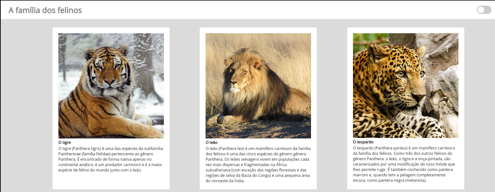
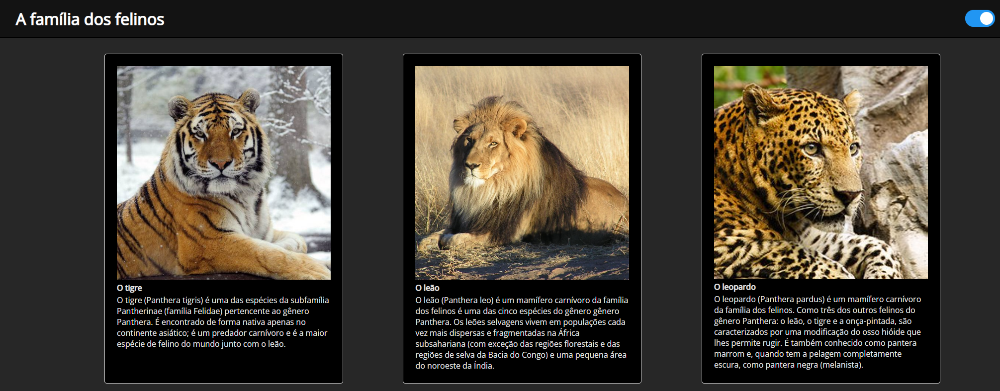

<h1 align="center"> Project Dark Mode </h1>

A cada click no botão superior da tela a página muda de cor inserindo famoso dark-mode.

 <a href="#-tecnologias">Tecnologias</a>&nbsp;&nbsp;&nbsp;|&nbsp;&nbsp;&nbsp;
  <a href="#-projeto">Projeto</a>&nbsp;&nbsp;&nbsp;|&nbsp;&nbsp;&nbsp;
  <a href="#-layout">Layout</a>&nbsp;&nbsp;&nbsp;|&nbsp;&nbsp;&nbsp;
  <a href="#-layout">Devs</a>&nbsp;&nbsp;&nbsp;|&nbsp;&nbsp;&nbsp;

 

---

## 🚀 Tecnologias

Esse projeto foi desenvolvido com as seguintes tecnologias:

- HTML
- CSS (Animation and Design Responsive)
- JavaScript(Eventos Dom, manipulação Dom e classLists)

---

## 💻 Projeto

A aplicação consiste em manipular o doom através de class para alternar entre cores.

---

## 🔖 Layout

Modo-Light

 Modo-Dark

---

## 💻 Desenvolvedores do Projeto:

Bruno Chaves - (https://www.linkedin.com/in/bchavs12/)
